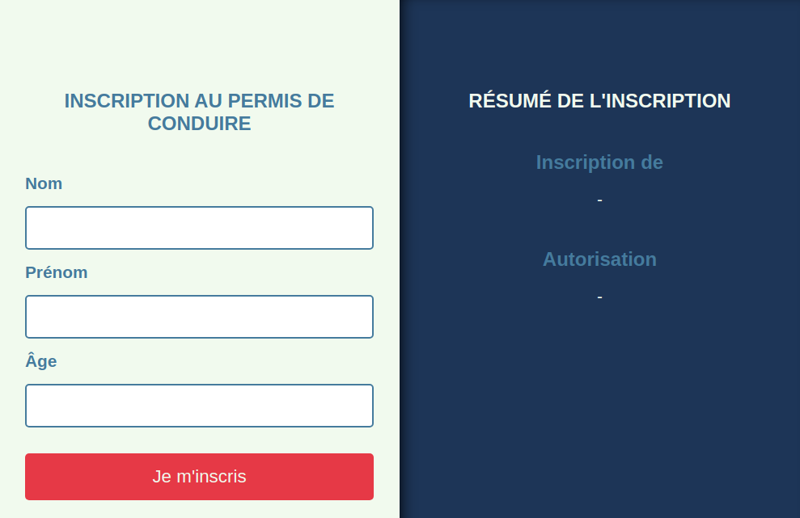

# Permis de conduire, le retour

## Objectifs

- Travailler les écouteurs d'événement
- Modifier le DOM

## Instructions

L'auto-école nous recontacte pour faire une nouvelle version de leur formulaire de pré-inscription. Ils se sont rendus compte que, comme ils n'enregistraient aucune information, tout pouvait être fait côté **frontend**, donc avec **Javascript**.

Pour rappel, ce formulaire permet de savoir si quelqu'un peut passer son permis de conduire. En tapant ses informations personnelles dans le formulaire, la partie **résumé** lui dira si l'inscription est possible.

## Comportement attendu

Quand on valide le formulaire, il faut afficher le nom et prénom de la personne sous *Inscription de*.
On affichera sous *Autorisation* un texte différent selon l'âge :

- Si la personne à moins de 16 ans : *Trop jeune pour s'inscrire*
- Si c'est entre 16 et 18 ans : *Inscription possible en conduite accompagnée*
- Sinon, afficher : *Inscription possible*

### Page par défaut

### Après soumission du formulaire

## Pistes

Si tu as besoin d'aide pour te lancer, voici quelques pistes :

- On a besoin de faire des actions après soumission du formulaire. Il faut donc *écouter* celle-ci en plaçant un [écouteur d'événement sur le fomulaire](https://developer.mozilla.org/fr/docs/Web/API/EventTarget/addEventListener#ajouter_un_%C3%A9couteur_simple).
- Pour modifier un élément de la page, il faut d'abord le [sélectionner](https://kourou.oclock.io/ressources/fiche-recap/dom/#queryselector-mdn) puis [changer son contenu](https://kourou.oclock.io/ressources/fiche-recap/dom/#innerhtml).
  
## Bonus

Pour aller plus loin, tu peux aussi :

- Faire une validation sur le formulaire (afficher une erreur si les champs sont vides).
- Si la personne a moins de 16 ans, afficher dans combien d'années elle peut s'inscrire.
